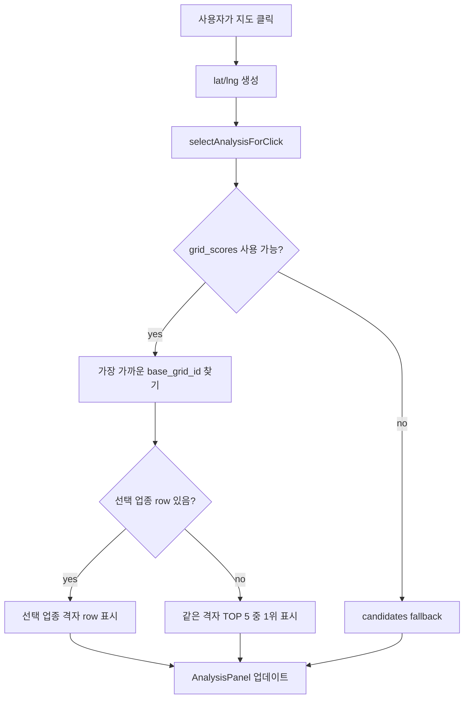
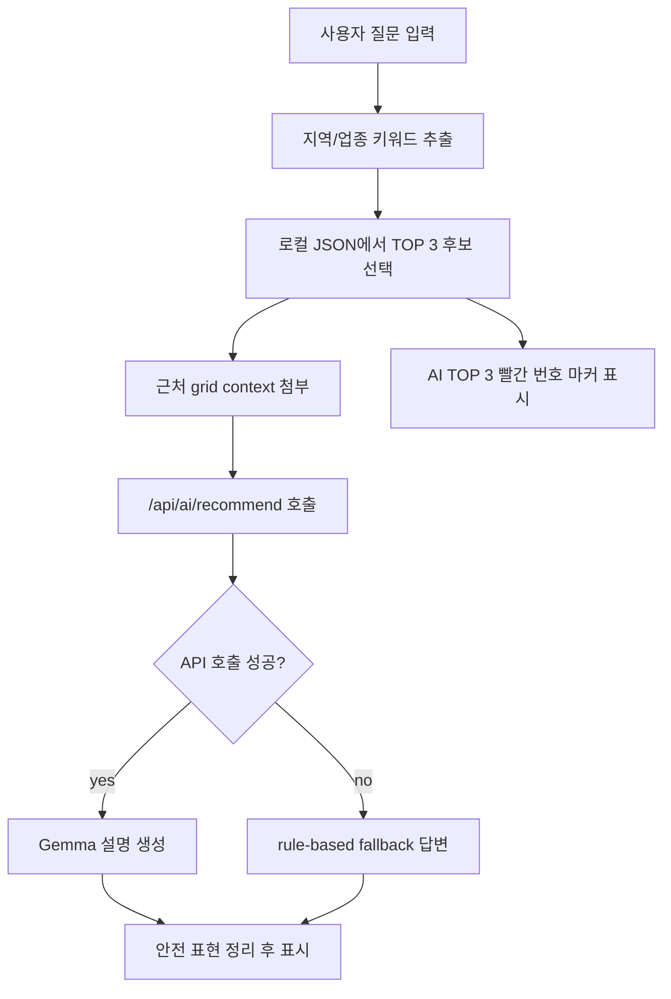

# BizSpot AI 웹 전체 구조 및 기능 상세 문서

## 1. 문서 목적

이 문서는 현재 BizSpot AI 웹 애플리케이션이 어떤 파일 구조로 구성되어 있고, `/map` 화면이 어떤 데이터와 코드 흐름으로 동작하는지 설명하기 위한 개발/발표/인수인계용 문서이다.

현재 웹은 광주광역시 상권 후보지를 공공데이터 기반 proxy 점수로 비교하는 1차 후보지 필터링 도구이다. 실제 창업 결과를 단정하는 서비스가 아니라, 후보지를 빠르게 좁히고 현장 검토 우선순위를 잡기 위한 의사결정 지원 화면으로 설계되어 있다.

## 2. 현재 실행 및 배포 상태

### 로컬 개발 서버

프론트엔드:

```bash
cd frontend
npm run dev
```

현재 개발 중에는 Vite 포트 충돌을 피하기 위해 `5174`에서 실행된 상태가 있다.

```text
http://localhost:5174/map
http://127.0.0.1:5174/map
```

로컬 AI 프록시 서버:

```bash
cd server
node server.js
```

```text
http://localhost:8787/api/health
http://localhost:8787/api/ai/recommend
```

### Vercel 배포

현재 배포 대표 URL:

```text
https://frontend-livid-pi-38.vercel.app
```

최신 production deployment 예시:

```text
https://frontend-9p0ye8xve-si-hoon-parks-projects.vercel.app
```

Vercel에서는 `server/` Express 서버를 직접 붙이지 않고, `frontend/api/` 아래 serverless function을 사용한다.

## 3. 전체 디렉터리 구조

현재 구현의 중심은 `frontend/`, `server/`, `scripts/`, `outputs/`이다.

```text
bizspot-ai/
├─ frontend/
│  ├─ api/
│  │  ├─ health.js
│  │  ├─ _aiPrompt.js
│  │  └─ ai/
│  │     └─ recommend.js
│  ├─ public/
│  │  └─ data/
│  │     ├─ candidates_balanced.json
│  │     ├─ candidates_by_industry.json
│  │     ├─ grid_scores.json
│  │     ├─ industry_recommendations_filtered.json
│  │     ├─ assistant_recommendation_context_filtered.json
│  │     ├─ district_summary.json
│  │     ├─ model_metrics.json
│  │     ├─ validation_summary.json
│  │     ├─ explanation_rules.json
│  │     └─ v9_data_quality.json
│  ├─ src/
│  │  ├─ components/
│  │  │  ├─ AiConsultPanel.jsx
│  │  │  ├─ AnalysisPanel.jsx
│  │  │  ├─ CandidateCard.jsx
│  │  │  ├─ FallbackMap.jsx
│  │  │  ├─ KakaoMap.jsx
│  │  │  └─ SafeNotice.jsx
│  │  ├─ pages/
│  │  │  ├─ HomePage.jsx
│  │  │  └─ MapPage.jsx
│  │  ├─ utils/
│  │  │  ├─ geo.js
│  │  │  ├─ industryLabel.js
│  │  │  ├─ kakaoLoader.js
│  │  │  ├─ recommendation.js
│  │  │  └─ safeText.js
│  │  ├─ App.jsx
│  │  ├─ main.jsx
│  │  └─ style.css
│  ├─ package.json
│  ├─ vercel.json
│  ├─ .env
│  └─ .env.example
├─ server/
│  ├─ server.js
│  ├─ aiPrompt.js
│  ├─ package.json
│  ├─ .env
│  └─ .env.example
├─ scripts/
│  └─ prepare_v9_web_data.py
├─ web/
│  └─ legacy static web files
├─ GOAL_PROGRESS.md
├─ WEB_VERIFICATION_REPORT.md
├─ DATA_CONNECTION_REPORT.md
├─ API_SETUP_GUIDE.md
└─ WEB_ARCHITECTURE_AND_FEATURES.md
```

`web/`는 기존 정적 웹을 보존한 레거시 폴더이며, 현재 React/Vite 구현은 `frontend/`가 담당한다.

## 4. 기술 스택

### 프론트엔드

- Vite
- React 19
- lucide-react 아이콘
- Kakao Maps JavaScript SDK
- fallback 2D pseudo-map
- 정적 JSON 데이터 로딩

### 백엔드/API

로컬 개발:

- Node.js
- Express
- CORS
- dotenv
- Google Generative Language API 호출

Vercel 배포:

- Vercel serverless functions
- `frontend/api/health.js`
- `frontend/api/ai/recommend.js`

### 데이터 생성

- Python script: `scripts/prepare_v9_web_data.py`
- 입력: v8 분석 산출물
- 출력: `frontend/public/data/*.json`

## 5. 라우팅 구조

라우팅은 React Router를 쓰지 않고, 현재 `window.location.pathname` 기준으로 간단하게 분기한다.

주요 화면:

```text
/      : 소개 및 진입 화면
/map   : 지도 기반 입지 분석 메인 화면
```

개념적으로는 다음과 같다.

```jsx
// frontend/src/App.jsx concept
const path = window.location.pathname

if (path === '/map') {
  return <MapPage />
}

return <HomePage />
```

Vercel에서는 `/map` 새로고침 시 SPA가 깨지지 않도록 `frontend/vercel.json`에 rewrite를 둔다.

```json
{
  "rewrites": [
    {
      "source": "/map",
      "destination": "/index.html"
    }
  ]
}
```

## 6. 데이터 파일 구성

`frontend/public/data/`의 JSON은 브라우저가 직접 fetch해서 읽는다.

현재 주요 데이터 건수:

| 파일 | 역할 | 현재 건수 |
|---|---:|---:|
| `candidates_balanced.json` | 지도 기본 후보지 및 AI 상담 후보지 | 160 |
| `grid_scores.json` | 지도 클릭 시 격자 기반 분석 lookup | 3,454 |
| `industry_recommendations_filtered.json` | 후보지 주변 업종 TOP 5 보조 정보 | 35 |
| `assistant_recommendation_context_filtered.json` | AI 설명 보조 context | 2 |

### 후보지 데이터 핵심 필드

```json
{
  "candidate_id": "GJ-29170-cafe-001",
  "name": "북구 용봉동 cafe 후보지",
  "sigungu": "북구",
  "dong": "용봉동",
  "lat": 35.0,
  "lng": 126.0,
  "recommended_industry": "cafe",
  "suitability_score": 78.2,
  "retention_proxy_score": 64.1,
  "risk_level": "보통",
  "demand_proxy_score": 70.0,
  "competition_burden_score": 55.0,
  "accessibility_score": 80.0,
  "cost_burden_proxy": 620000,
  "cost_inverted_score": 72.0,
  "industry_fit_score": 66.0,
  "positive_reasons": [],
  "negative_reasons": []
}
```

### 격자 점수 데이터 핵심 필드

`grid_scores.json`은 지도에 전부 찍는 데이터가 아니라, 사용자가 지도 위치를 클릭했을 때 가장 가까운 상권 격자를 찾아 분석하기 위한 lookup 데이터이다.

```json
{
  "grid_id": "GJ-grid-0001-cafe",
  "base_grid_id": "GJ-grid-0001",
  "center_lat": 35.1782,
  "center_lng": 126.9123,
  "sigungu": "북구",
  "dong": "용봉동",
  "radius_m": 500,
  "industry": "cafe",
  "suitability_score": 78.2,
  "retention_proxy_score": 64.1,
  "risk_level": "보통",
  "demand_proxy_score": 70.0,
  "competition_burden_score": 55.0,
  "accessibility_score": 80.0,
  "cost_burden_proxy": 620000,
  "cost_inverted_score": 72.0,
  "industry_fit_score": 66.0,
  "positive_reasons": [],
  "negative_reasons": []
}
```

## 7. 점수 의미와 산식

### `suitability_score`

웹에서 보여주는 종합 입지 적합도 점수이다.

산식:

```text
suitability_score =
  demand_proxy_score * 0.30
  + accessibility_score * 0.20
  + industry_fit_score * 0.20
  + competition_burden_score * 0.15
  + cost_inverted_score * 0.15
```

의미:

- 수요 proxy
- 교통 접근성 proxy
- 업종 궁합
- 경쟁 부담 완화
- 비용 부담 완화

### `retention_proxy_score`

상가정보 스냅샷상 관측 유지 패턴 기반 보조 점수이다.

중요한 제한:

- `suitability_score`와 같은 산식으로 만들지 않는다.
- 메인 종합 점수를 대체하지 않는다.
- 후보지를 비교할 때 보조 참고 지표로만 표시한다.

### `cost_burden_proxy`와 `cost_inverted_score`

공시지가와 실거래가 계열 데이터는 실제 임대료가 아니므로 비용 부담 proxy로만 표현한다.

- `cost_burden_proxy`: 비용 부담 proxy 원 지표
- `cost_inverted_score`: 비용 부담 proxy가 낮을수록 높아지는 역정규화 점수

## 8. `/map` 화면 전체 구성

`/map`은 3열 구조이다.

```text
좌측 패널          중앙 지도             우측 분석 패널
조건 필터          Kakao Map             선택 후보 분석
상위 후보 목록      fallback map          격자 분석 결과
AI 상담            후보/격자 마커         추천/주의 사유
```

담당 파일:

| 영역 | 파일 |
|---|---|
| 화면 전체 상태 관리 | `frontend/src/pages/MapPage.jsx` |
| Kakao/fallback 지도 전환 | `frontend/src/components/KakaoMap.jsx` |
| 2D fallback 지도 | `frontend/src/components/FallbackMap.jsx` |
| 우측 분석 패널 | `frontend/src/components/AnalysisPanel.jsx` |
| 후보지 카드 | `frontend/src/components/CandidateCard.jsx` |
| AI 상담 패널 | `frontend/src/components/AiConsultPanel.jsx` |

## 9. `MapPage.jsx`의 역할

`MapPage.jsx`는 `/map` 화면의 중심 컨트롤러이다.

주요 state:

```jsx
const [candidates, setCandidates] = useState([])
const [gridScores, setGridScores] = useState([])
const [industryRecommendations, setIndustryRecommendations] = useState([])
const [district, setDistrict] = useState('전체')
const [industry, setIndustry] = useState('cafe')
const [selectedCandidate, setSelectedCandidate] = useState(null)
const [clickedPoint, setClickedPoint] = useState(null)
const [clickInfo, setClickInfo] = useState(null)
const [aiRecommendations, setAiRecommendations] = useState([])
```

초기 로딩 흐름:

```jsx
Promise.all([
  loadJson('/data/candidates_balanced.json'),
  loadJson('/data/grid_scores.json').catch(() => []),
  loadJson('/data/industry_recommendations_filtered.json'),
])
```

지도 클릭 처리:

```jsx
const result = selectAnalysisForClick({
  gridScores,
  candidates,
  point,
  selectedIndustry: industry,
})

setClickedPoint(point)
setClickInfo(result)
if (result?.candidate) setSelectedCandidate(result.candidate)
```

즉, `/map`에서는 사용자가 지도 클릭 또는 후보 선택을 하면 `selectedCandidate`와 `clickInfo`가 갱신되고, 우측 분석 패널이 다시 렌더링된다.

## 10. Kakao Map과 fallback map 구조

### Kakao 우선 로딩

`frontend/src/utils/kakaoLoader.js`가 `VITE_KAKAO_MAP_KEY`를 이용해 Kakao Maps SDK를 로드한다.

개념:

```js
const key = import.meta.env.VITE_KAKAO_MAP_KEY
const script = document.createElement('script')
script.src = `https://dapi.kakao.com/v2/maps/sdk.js?appkey=${key}&autoload=false`
```

Kakao SDK 로딩이 성공하면 `KakaoMap.jsx`에서 실제 지도를 생성한다.

```jsx
const center = new kakao.maps.LatLng(GWANGJU_CENTER.lat, GWANGJU_CENTER.lng)
mapInstance.current = new kakao.maps.Map(mapRef.current, {
  center,
  level: 7,
})
```

지도 클릭 이벤트는 공통 클릭 분석 함수로 전달된다.

```jsx
kakao.maps.event.addListener(mapInstance.current, 'click', (event) => {
  onMapClick({
    lat: event.latLng.getLat(),
    lng: event.latLng.getLng(),
  })
})
```

### fallback map

Kakao key가 없거나 SDK 로드에 실패하면 fallback map으로 전환한다. 이 경우도 blocker가 아니다.

fallback map은 실제 지도 타일이 아니라 광주 bounding box를 기준으로 만든 2D pseudo-map이다.

담당 파일:

```text
frontend/src/components/FallbackMap.jsx
frontend/src/utils/geo.js
```

광주 범위:

```js
export const GWANGJU_BOUNDS = {
  minLat: 35.02,
  maxLat: 35.32,
  minLng: 126.65,
  maxLng: 127.02,
}
```

fallback map에서 패널을 클릭하면 화면상 x/y 비율을 위경도로 변환한다.

```js
export function pointFromFallbackClick(event, element) {
  const rect = element.getBoundingClientRect()
  const x = (event.clientX - rect.left) / rect.width
  const y = (event.clientY - rect.top) / rect.height

  return {
    lng: GWANGJU_BOUNDS.minLng + x * (GWANGJU_BOUNDS.maxLng - GWANGJU_BOUNDS.minLng),
    lat: GWANGJU_BOUNDS.maxLat - y * (GWANGJU_BOUNDS.maxLat - GWANGJU_BOUNDS.minLat),
  }
}
```

이렇게 만든 좌표를 Kakao 지도 클릭과 동일한 `handleMapClick(lat, lng)` 흐름으로 보낸다.

## 11. 마커 표시 정책

`grid_scores.json`은 row 수가 많기 때문에 전체를 마커로 찍지 않는다. 지도 성능과 시각적 가독성을 위해 표시 개수를 제한한다.

현재 정책:

| 상황 | 표시 마커 |
|---|---|
| 전체 업종 | `candidates_balanced.json` 상위 100개 |
| 업종 필터 선택 | 해당 업종 후보/상위 격자 중 상위 40개 |
| AI 상담 결과 | TOP 3 빨간 번호 마커 |
| `grid_scores.json` 전체 | 마커 전체 표시 금지, 클릭 분석 lookup으로 사용 |

구현 위치:

```text
frontend/src/components/KakaoMap.jsx
```

핵심 코드:

```jsx
function buildMarkerRows({ candidates, gridScores, selectedIndustry }) {
  if (selectedIndustry === 'all') {
    return uniqueMarkers(sortByScore(candidates)).slice(0, 100)
  }

  const candidateRows = sortByScore(
    candidates.filter((row) => row.recommended_industry === selectedIndustry),
  )
  const gridRows = sortByScore(
    gridScores.filter((row) => row.industry === selectedIndustry || row.recommended_industry === selectedIndustry),
  )

  return uniqueMarkers([...candidateRows, ...gridRows]).slice(0, 40)
}
```

## 12. 지도 클릭 분석 로직

지도 클릭 분석은 `grid_scores.json`을 우선 사용한다.

담당 파일:

```text
frontend/src/utils/recommendation.js
```

우선순위:

1. 클릭 위치에서 가장 가까운 `base_grid_id`를 찾는다.
2. 해당 격자 안에서 선택 업종 row를 찾는다.
3. 선택 업종 row가 있으면 그 row를 분석 결과로 표시한다.
4. 선택 업종 row가 없으면 같은 격자 안의 업종 TOP 5 중 1위를 표시한다.
5. 격자 데이터가 없으면 후보지 기반 fallback으로 이동한다.
6. 클릭 위치와 분석 중심점 거리가 1km 이상이면 참고 안내 문구를 표시한다.

핵심 코드:

```js
export function selectAnalysisForClick({ gridScores, candidates, point, selectedIndustry }) {
  const gridResult = selectGridForClick(gridScores, point, selectedIndustry)
  if (gridResult) return gridResult

  const candidateResult = selectCandidateForClick(
    candidates,
    point,
    selectedIndustry === 'all' ? 'cafe' : selectedIndustry,
  )

  return candidateResult
    ? {
        ...candidateResult,
        analysisType: 'candidate',
        clickedPoint: point,
      }
    : null
}
```

격자 선택:

```js
export function selectGridForClick(gridScores, point, selectedIndustry) {
  const nearest = nearestGridBase(gridScores, point)
  if (!nearest) return null

  const rowsInGrid = sortByScore(
    gridScores.filter((row) => row.base_grid_id === nearest.grid.base_grid_id),
  )

  const industryRow =
    selectedIndustry && selectedIndustry !== 'all'
      ? rowsInGrid.find(
          (row) => row.industry === selectedIndustry || row.recommended_industry === selectedIndustry,
        )
      : null

  const selectedRow = industryRow || rowsInGrid[0]

  return {
    candidate: selectedRow,
    distanceKm: nearest.distanceKm,
    distant: nearest.distanceKm > 1,
    analysisType: 'grid',
    baseGridId: nearest.grid.base_grid_id,
    gridTop5: rowsInGrid.slice(0, 5),
    clickedPoint: point,
  }
}
```

## 13. 후보지 fallback 로직

격자 데이터가 없거나 사용할 수 없는 경우 기존 후보지 방식으로 fallback한다.

fallback 우선순위:

1. 선택 업종 + 1km 이내 후보
2. 선택 업종 + 같은 자치구 후보
3. 모든 업종 + 1km 이내 후보
4. 모든 업종 + 같은 자치구 후보
5. 광주 전체 상위 후보

이 방식은 `grid_scores.json`이 생성되지 않아도 `/map` 핵심 분석 기능이 계속 동작하도록 하기 위한 안전장치이다.

## 14. 우측 분석 패널

담당 파일:

```text
frontend/src/components/AnalysisPanel.jsx
```

표시 정보:

- 분석 기준
- 선택 좌표
- 분석 격자 또는 후보 중심
- 거리
- 입지 적합도
- 영업 유지 proxy 점수
- 위험도
- 선택 업종
- 이 격자 추천 업종 TOP 5
- 추천 사유
- 주의 사유
- 안전 문구

격자 기반 분석일 때는 `analysisType === 'grid'` 또는 `source_type === 'grid'`를 기준으로 배지를 표시한다.

```jsx
const isGridAnalysis = clickInfo?.analysisType === 'grid' || candidate.source_type === 'grid'
```

## 15. AI 상담 기능 구조

AI 상담은 사용자의 질문을 받아 서버가 마음대로 후보지를 새로 만드는 구조가 아니다. 브라우저가 먼저 로컬 JSON에서 TOP 3 후보를 고르고, 서버는 그 TOP 3을 자연어로 설명만 한다.

담당 파일:

```text
frontend/src/components/AiConsultPanel.jsx
frontend/src/utils/recommendation.js
server/server.js
server/aiPrompt.js
frontend/api/ai/recommend.js
frontend/api/_aiPrompt.js
```

### 브라우저에서 TOP 3 선택

```js
const { parsed, recommendations } = selectTop3ForQuestion(candidates, question)
const recommendationsWithGrid = attachGridContext(recommendations, gridScores)
```

질문에서 지역/업종 키워드를 간단히 추출하고, 다음 순서로 후보를 합친다.

1. 지역 + 업종이 모두 맞는 후보
2. 지역만 맞는 후보
3. 업종만 맞는 후보
4. 전체 후보

중복 제거 후 상위 3개를 선택한다.

### API 호출

```js
const response = await fetch(`${API_BASE}/api/ai/recommend`, {
  method: 'POST',
  headers: { 'Content-Type': 'application/json' },
  body: JSON.stringify({ question, parsed, candidates: recommendationsWithGrid }),
})
```

### production에서 localhost 호출 방지

Vercel production 번들에서 `.env`의 localhost API 주소가 섞여 들어가면 브라우저가 사용자 PC의 localhost를 호출하려고 한다. 이를 막기 위해 production에서는 localhost API base를 무시하고 같은 origin의 `/api`를 사용한다.

```js
const configuredApiBase = import.meta.env.VITE_API_BASE_URL || ''
const localApiBasePattern = /^https?:\/\/(localhost|127\.0\.0\.1)(:\d+)?/i
const API_BASE = import.meta.env.PROD
  ? localApiBasePattern.test(configuredApiBase)
    ? ''
    : configuredApiBase
  : configuredApiBase || 'http://localhost:8787'
```

## 16. 로컬 Express 서버

담당 파일:

```text
server/server.js
```

역할:

- `/api/health`
- `/api/ai/recommend`
- Gemini/Gemma API 호출
- API key가 없거나 호출 실패 시 rule-based fallback 응답 반환
- 프론트 개발 서버 CORS 허용

CORS 허용 origin:

```js
const allowedOrigins = new Set([
  'http://localhost:5173',
  'http://127.0.0.1:5173',
  'http://localhost:5174',
  'http://127.0.0.1:5174',
])
```

health 응답:

```js
app.get('/api/health', (_req, res) => {
  res.json({
    ok: true,
    geminiConfigured: hasGeminiKey(),
    model: process.env.GEMMA_MODEL || 'gemma-4-31b-it',
  })
})
```

AI 추천 설명 endpoint:

```js
app.post('/api/ai/recommend', async (req, res) => {
  const { question, candidates } = req.body || {}
  const topCandidates = candidates.slice(0, 3)

  if (!hasGeminiKey()) {
    res.json({
      fallback: true,
      answer: buildFallbackAnswer({ candidates: topCandidates }),
      reason: 'GEMINI_API_KEY is missing',
    })
    return
  }

  const answer = await callGemini({
    question: String(question || ''),
    candidates: topCandidates,
  })

  res.json({
    fallback: false,
    answer: sanitizeAnswer(answer),
  })
})
```

## 17. Vercel serverless API

Vercel에서는 `server/` Express 서버가 아니라 `frontend/api/`가 production API가 된다.

```text
frontend/api/health.js
frontend/api/ai/recommend.js
```

Vercel API health:

```js
export default function handler(_req, res) {
  res.status(200).json({
    ok: true,
    geminiConfigured: Boolean(process.env.GEMINI_API_KEY),
    model: process.env.GEMMA_MODEL || 'gemma-4-31b-it',
  })
}
```

Vercel AI endpoint도 로컬 Express와 같은 원칙을 따른다.

- 요청 후보 배열에서 TOP 3만 사용
- 서버에서 새 후보 생성 금지
- API key가 없으면 fallback 응답
- 모델 호출이 실패해도 fallback 응답
- 응답 텍스트는 안전 표현으로 정리

## 18. Gemma/Gemini 응답 처리

현재 모델:

```env
GEMMA_MODEL=gemma-4-31b-it
```

호출 endpoint:

```js
const endpoint = `https://generativelanguage.googleapis.com/v1beta/models/${encodeURIComponent(
  model,
)}:generateContent?key=${encodeURIComponent(process.env.GEMINI_API_KEY)}`
```

Gemma 계열 응답에는 사고 과정용 part가 섞일 수 있으므로, `thought === true`인 part는 화면에 표시하지 않는다.

```js
const text =
  payload?.candidates?.[0]?.content?.parts
    ?.filter((part) => part?.text && part.thought !== true)
    ?.map((part) => part.text)
    .filter(Boolean)
    .join('\n') || ''
```

이 처리를 하지 않으면 사용자가 보기에는 답변이 늦거나 이상한 내부 서술이 섞여 보일 수 있다.

## 19. 환경변수 구성

### `frontend/.env`

브라우저에서 읽어야 하는 Vite 환경변수는 반드시 `VITE_` prefix가 있어야 한다.

```env
VITE_KAKAO_MAP_KEY=YOUR_KAKAO_JAVASCRIPT_KEY
VITE_API_BASE_URL=http://localhost:8787
```

주의:

- `VITE_KAKAO_MAP_KEY`는 Kakao JavaScript 키이다.
- Admin key, REST API key, Native key가 아니다.
- production에서는 localhost API base가 자동으로 무시되고 같은 origin API를 사용한다.

### `server/.env`

```env
GEMINI_API_KEY=YOUR_GOOGLE_AI_STUDIO_API_KEY
GEMMA_MODEL=gemma-4-31b-it
PORT=8787
```

### Vercel 환경변수

Vercel project settings에는 다음 값이 필요하다.

```text
GEMINI_API_KEY
GEMMA_MODEL
VITE_KAKAO_MAP_KEY
```

`VITE_API_BASE_URL`은 production에서 비워두거나 같은 origin API를 쓰는 구성이 안전하다.

## 20. Kakao 지도 연동 체크리스트

Kakao Developers에서 확인할 것:

1. 사용 중인 앱의 JavaScript 키를 `frontend/.env`에 넣는다.
2. Kakao Map API 사용 설정이 활성화되어 있어야 한다.
3. JavaScript SDK 도메인에 로컬과 배포 URL을 등록한다.

등록 예:

```text
http://localhost:5174
http://127.0.0.1:5174
https://frontend-livid-pi-38.vercel.app
https://frontend-9p0ye8xve-si-hoon-parks-projects.vercel.app
```

주의:

- 도메인 등록 후 저장 버튼을 눌러야 한다.
- 배포 URL이 바뀌면 새 URL도 등록해야 한다.
- stable alias를 쓰면 매번 deployment URL을 추가하지 않아도 된다.

Kakao SDK 로딩 실패 시:

- fallback map이 표시된다.
- 이 상태도 핵심 기능 검증 실패로 보지 않는다.
- 다만 실제 지도 타일 검증은 Kakao 설정 완료 후 별도 확인한다.

## 21. 안전 문구와 표현 정책

웹은 다음 표현을 기본으로 사용한다.

- 입지 적합도
- 창업 적합도
- 영업 유지 proxy 점수
- 상가정보 스냅샷상 관측 유지
- 공공데이터 기반 후보지 점수
- 비용 부담 proxy
- 1차 후보지 필터링
- 참고 지표
- 의사결정 지원

사용자가 오해할 수 있는 단정형 표현은 쓰지 않는다.

대체 원칙:

| 위험한 의미 | 현재 웹 표현 |
|---|---|
| 결과를 보장하는 표현 | 참고 지표, 1차 후보지 필터링 |
| 판매 성과를 직접 추정하는 표현 | 공공데이터 proxy 기반 비교 |
| 점포 종료를 직접 단정하는 표현 | 스냅샷상 관측되지 않음 |
| 확률처럼 보이는 표현 | proxy 점수, 적합도 점수 |

AI 응답도 `sanitizeSafeText()`와 서버의 `sanitizeAnswer()`를 거쳐 안전 표현으로 정리된다.

## 22. 홈 화면 구조

담당 파일:

```text
frontend/src/pages/HomePage.jsx
frontend/src/style.css
```

구성:

- 상단 navigation
- dark hero section
- `BizSpot AI` 브랜드 타이틀
- 광주 공공데이터 기반 분석 배지
- 지도 진입 버튼
- 분석 방법 보기 버튼
- 통계 카드
- how it works 섹션

사용자가 제공한 디자인 레퍼런스에 맞춰 dark hero, blue accent, 중앙 정렬형 브랜드 화면으로 구성했다.

## 23. CSS 구성

담당 파일:

```text
frontend/src/style.css
```

주요 스타일 그룹:

```text
home-nav
hero-section
hero-actions
stat-strip
map-page
map-header
map-grid
control-panel
map-stage
kakao-map
fallback-map
analysis-panel
ai-panel
candidate-card
score-bar
safe-notice
```

지도 화면은 desktop 기준 3열 layout이다. fallback map은 CSS grid background를 사용해 pseudo-map 느낌을 준다.

## 24. 데이터 생성 스크립트

담당 파일:

```text
scripts/prepare_v9_web_data.py
```

역할:

1. v8 분석 데이터에서 최신 스냅샷 기준 후보를 필터링한다.
2. 허용 업종만 남긴다.
3. 좌표가 없거나 광주 범위 밖인 row를 제거한다.
4. 업종별 후보를 균형 있게 선별한다.
5. `candidates_balanced.json`을 생성한다.
6. 500m commercial grid 기반 `grid_scores.json`을 생성한다.
7. 웹에서 사용할 보조 JSON을 생성한다.
8. 데이터 품질 요약을 `v9_data_quality.json`에 저장한다.

허용 업종:

```text
cafe
dessert_bakery
restaurant_general
bunsik
chicken
convenience_store
beauty_hair
laundry
```

`other`는 사용자 표시용 추천 후보와 TOP 5에서 제외한다.

## 25. Vercel 배포 구조

Vercel project root는 `frontend/`이다.

빌드:

```bash
cd frontend
npm run build
```

배포:

```bash
npx vercel build --prod
npx vercel deploy --prebuilt --prod
```

Vercel에서 확인할 endpoint:

```text
/
/map
/api/health
/api/ai/recommend
```

production API는 다음 흐름이다.

```text
browser
  -> /api/ai/recommend
  -> frontend/api/ai/recommend.js
  -> Google Generative Language API
  -> sanitized answer
  -> browser
```

## 26. 주요 기능별 파일 매핑

| 기능 | 핵심 파일 |
|---|---|
| 홈 화면 | `frontend/src/pages/HomePage.jsx` |
| 지도 화면 전체 | `frontend/src/pages/MapPage.jsx` |
| Kakao SDK 로드 | `frontend/src/utils/kakaoLoader.js` |
| 실제 Kakao 지도 | `frontend/src/components/KakaoMap.jsx` |
| fallback pseudo-map | `frontend/src/components/FallbackMap.jsx` |
| 좌표/거리 계산 | `frontend/src/utils/geo.js` |
| 후보 정렬/검색/클릭 분석 | `frontend/src/utils/recommendation.js` |
| 우측 분석 패널 | `frontend/src/components/AnalysisPanel.jsx` |
| AI 상담 UI | `frontend/src/components/AiConsultPanel.jsx` |
| 안전 문구 처리 | `frontend/src/utils/safeText.js` |
| 로컬 AI 서버 | `server/server.js` |
| 로컬 AI prompt | `server/aiPrompt.js` |
| Vercel AI API | `frontend/api/ai/recommend.js` |
| Vercel prompt | `frontend/api/_aiPrompt.js` |
| 웹 데이터 생성 | `scripts/prepare_v9_web_data.py` |

## 27. 전체 동작 흐름

### 지도 클릭 분석



### AI 상담



## 28. 검증된 동작

현재까지 확인된 사항:

- `/map` 로컬 화면 로딩
- Kakao key 미설정 또는 로딩 실패 시 fallback map 표시
- fallback map 클릭 좌표 변환
- grid-first 클릭 분석
- candidates fallback 유지
- AI 상담 TOP 3 후보 선택
- AI TOP 3 빨간 번호 마커 유지
- 로컬 Express API health 응답
- Vercel API health 응답
- Vercel AI endpoint에서 모델 응답 확인
- 모델 응답의 thought part 필터링
- production에서 localhost API 호출 방지

## 29. 제한 사항

현재 웹은 다음 한계를 명확히 가진다.

1. `grid_scores.json`은 광주 전체의 모든 빈 격자를 완벽히 채운 행정 격자 데이터가 아니다.
2. 상가 데이터가 존재하는 commercial grid 중심의 분석 데이터이다.
3. 빈 지역 클릭 시 가장 가까운 분석 격자 또는 후보지 fallback을 사용한다.
4. 실시간 모델 학습이나 실시간 공간 연산을 수행하지 않는다.
5. AI는 새 후보지, 새 좌표, 새 순위를 생성하지 않는다.
6. 비용 변수는 실제 월세가 아니라 비용 부담 proxy이다.
7. 실제 창업 판단에는 임대료, 권리금, 점포 내부 상태, 브랜드 전략, 실제 유동인구 등 추가 확인이 필요하다.

## 30. 개발자가 자주 볼 파일

프론트 UI를 고칠 때:

```text
frontend/src/pages/MapPage.jsx
frontend/src/components/KakaoMap.jsx
frontend/src/components/FallbackMap.jsx
frontend/src/components/AnalysisPanel.jsx
frontend/src/components/AiConsultPanel.jsx
frontend/src/style.css
```

지도 클릭 분석을 고칠 때:

```text
frontend/src/utils/recommendation.js
frontend/src/utils/geo.js
```

AI 응답을 고칠 때:

```text
server/aiPrompt.js
frontend/api/_aiPrompt.js
server/server.js
frontend/api/ai/recommend.js
frontend/src/utils/safeText.js
```

데이터를 다시 만들 때:

```text
scripts/prepare_v9_web_data.py
frontend/public/data/
```

배포 설정을 볼 때:

```text
frontend/vercel.json
frontend/package.json
```

## 31. 문제 발생 시 빠른 점검

### Kakao 지도가 아니라 fallback이 뜰 때

확인 순서:

1. `frontend/.env`에 `VITE_KAKAO_MAP_KEY`가 있는지 확인한다.
2. Vite dev server를 재시작한다.
3. Kakao Developers에 현재 origin이 등록되어 있는지 확인한다.
4. Kakao Map API가 활성화되어 있는지 확인한다.
5. 배포 URL이 바뀌었다면 stable alias를 쓰거나 새 URL을 등록한다.

### AI가 fallback 답변을 줄 때

확인 순서:

1. 로컬이면 `server/.env`에 `GEMINI_API_KEY`가 있는지 확인한다.
2. 로컬 Express 서버가 `8787`에서 떠 있는지 확인한다.
3. Vercel이면 project environment variable에 `GEMINI_API_KEY`, `GEMMA_MODEL`이 있는지 확인한다.
4. `/api/health`에서 `geminiConfigured: true`인지 확인한다.
5. 모델 응답이 느릴 수 있으므로 20~45초 정도는 정상 범위로 본다.

### production에서 AI가 안 될 때

확인 순서:

1. 브라우저가 `localhost:8787`을 호출하고 있지 않은지 확인한다.
2. production bundle에서는 `API_BASE`가 빈 문자열이 되어 `/api/ai/recommend`를 호출해야 한다.
3. Vercel serverless function 로그를 확인한다.
4. 환경변수 변경 후 재배포했는지 확인한다.

## 32. 유지보수 원칙

1. `new_store_survived_12m` 계열 결과는 메인 추천 점수에 넣지 않는다.
2. `suitability_score`와 `retention_proxy_score`는 같은 산식으로 만들지 않는다.
3. `grid_scores.json` 전체를 지도 마커로 표시하지 않는다.
4. AI는 로컬 JSON에서 선택된 후보를 설명만 한다.
5. Kakao key가 없더라도 fallback map은 계속 동작해야 한다.
6. 배포 production에서는 Express 서버 의존 없이 Vercel serverless API가 동작해야 한다.
7. 사용자에게 확률처럼 오해될 수 있는 표현은 쓰지 않는다.

## 33. 현재 결론

현재 BizSpot AI 웹은 다음 구조로 완성되어 있다.

- React/Vite 기반 `frontend/` 앱
- Kakao SDK 우선 지도
- Kakao 실패 시 2D fallback map
- `grid_scores.json` 기반 지도 클릭 분석
- `candidates_balanced.json` 기반 후보지 fallback
- AI 상담 TOP 3 후보 설명
- 로컬 Express API
- Vercel serverless API
- Vercel 배포
- 안전 표현 기반 결과 표시

따라서 시연에서는 `/map`에서 다음 두 가지 핵심 흐름을 보여주면 된다.

1. 지도 클릭 후 우측 패널에서 500m 격자 기반 분석 결과 확인
2. AI 상담에 지역/업종 질문을 입력해 TOP 3 후보와 자연어 설명 확인

